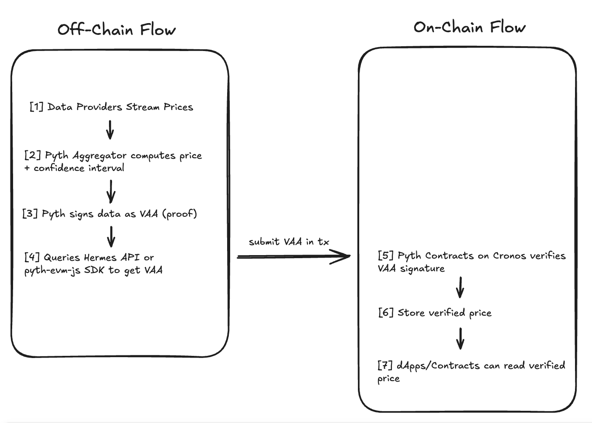

# PythPrice on Cronos Testnet

## TL;DR
> A minimal example of integrating [Pyth Network](https://pyth.network) price feeds (CRO/USD) into a smart contract on the Cronos Testnet using Pyth's Pull Model and `@pythnetwork/pyth-evm-js`.

---

This project demonstrates how to integrate **Pyth Network’s price oracle** into a smart contract deployed on the **Cronos Testnet**. It follows Pyth’s Pull Model, where price data is fetched off-chain via SDK and submitted on-chain for verification and use.

## Tech Stack
- Solidity
- Hardhat
- Ethers.js
- Pyth Network (Pull Model)
- Cronos Testnet

## Use Case
Fetch and store verified real-time **CRO/USD prices** from Pyth Network utilizing their pull model. This allows dApps or smart contracts to access accurate, tamper-proof price feeds.

An example of this be a DeFi apps that need accurate CRO/USD rates for lending, liquidation, or real-time asset pricing.

## Why We Chose Pyth Network
Pyth Network was selected because of its Cronos Support, fast price updates and pull-based model for gas-efficient data access. 

For a more detailed breakdown of how Pyth works on Cronos and why its ideal, see the [full Pyth integration explanation](./docs/PYTH_OVERVIEW.md). 

## Project Structure
```
├── contracts/
│ └── PythPrice.sol # Smart contract to fetch and store verified Pyth price
├── scripts/
│ ├── deploy.js # Script to deploy the smart contract
│ └── fetch-price.js # Script to fetch and submit CRO/USD price
├── .env # RPC URL & private key
└── hardhat.config.js
```

## Setup

### 1. Clone Repository

```
git clone https://github.com/yourusername/pyth-cronos-oracle.git
cd pyth-cronos-oracle
```
### 2. Install Dependencies
```
npm install
```

### 3. Create .env File
```
CRONOS_RPC=https://evm-t3.cronos.org
PRIVATE_KEY=your_private_key_here
```

## Deploy Contract
```
npx hardhat run scripts/deploy.js --network cronos_testnet
```
This will deploy the PythPrice contract to Cronos Testnet using the Pyth Oracle address. If you want to deploy to Cronos Mainnet simply adjust the `PYTH_CONTRACT_ADDRESS` variable in `deploy.js`.

### Cronos EVM
- Mainnet: [0xe0d0e68297772dd5a1f1d99897c581e2082dba5b](https://cronoscan.com/address/0xe0d0e68297772dd5a1f1d99897c581e2082dba5b)
- Testnet: [0x36825bf3Fbdf5a29E2d5148bfe7Dcf7B5639e320](https://cronos.org/explorer/testnet3/address/0x36825bf3Fbdf5a29E2d5148bfe7Dcf7B5639e320)

### Successful deployment will show the following:
```
Deploying PythPrice contract ...
Using Pyth Oracle Address:  0x36825bf3Fbdf5a29E2d5148bfe7Dcf7B5639e320
Deployed PythPrice to:", 0xDDe28D67ABd7d5D0920bD6995c2F186dD7C2153a
```

## Fetch & Submit Price
Once deployed, replace `contract_address` with the contract address from the deploy step and run the `fetch-price.js` script:

```bash
node scripts/fetch-price.js
```
or
```bash
npx hardhat run scripts/fetch-price.js --network cronos_testnet
```
### What it does:
1. Connects to the deployed contract
2. Uses `@pythnetwork/pyth-evm-js` SDK to fetch the latest VAA data for CRO/USD
3. Calculates the update fee
4. Submits data to the contract
5. Logs `PriceUpdate` event or Fallback to reading latest price directly from contract

### How Pyth's Pull Model Works



For a more detailed break down please refer to the [full Pyth integration explanation](./docs/PYTH_OVERVIEW.md).

### Feed ID Used
For this project we used the price feed id that corresponds to CRO/USD

- CRO/USD: `0x23199c2bcb1303f667e733b9934db9eca5991e765b45f5ed18bc4b231415f2fe`

You can replace this with any other [Pyth-supported feed](https://www.pyth.network/developers/price-feed-ids) as needed. Simply change `price_feed_id` in `fetch-price.js`. 

### Example Ouput
```
Connected to contract:  0xDDe28D67ABd7d5D0920bD6995c2F186dD7C2153a
Update fee: 1
Price fetched. Tx Hash: 0x985780708ff161ccc0a4948aa81c13e1e4c87e336e90ee2db3ae8aa1a6883e04
PriceUpdated event: priceFeed=0x23199c2bcb1303f667e733b9934db9eca5991e765b45f5ed18bc4b231415f2fe, price=10154740
```
## Contributing
PRs and Issues are welcome. If you would like to expand this project to support more feeds or networks, feel free to fork and build on it.

## Resources
- [Pyth Network](https://www.pyth.network/)
- [Cronos Documentation](https://docs.cronos.org/for-dapp-developers/dev-tools-and-integrations/pyth)
- [Cronos Testnet Faucet](https://cronos.org/faucet)
- [pyth-evm-js SDK](https://www.npmjs.com/package/@pythnetwork/pyth-evm-js)
- [Pyth Price Feeds](https://www.pyth.network/developers/price-feed-ids)
- [HardHat](https://hardhat.org/)